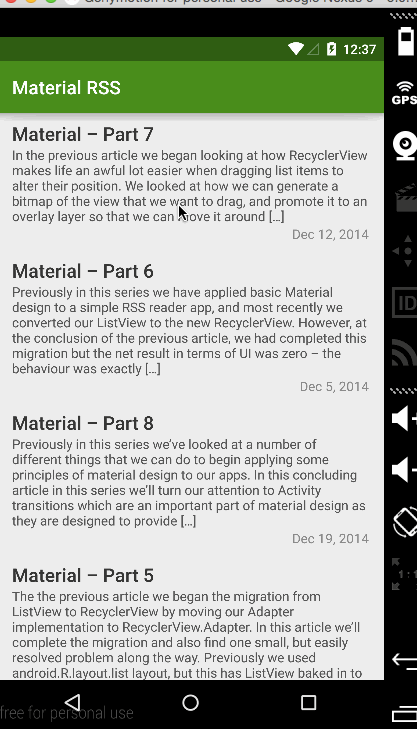

# Material Design Instagram Android app Demo

This is a material design Android demo application for showing RSS feeds in Android Lollipop. 

See [Styling Android blog](https://blog.stylingandroid.com/) for step-by-step tutorial.

Features:

 * [x] Android 5.0 RecycleView
 * [x] Android 5.0 CardView
 * [x] Android 5.0 Material Design Activity transition
 * [x] Re-order RecyclerView list item

GIF created with [LiceCap](http://www.cockos.com/licecap/).
